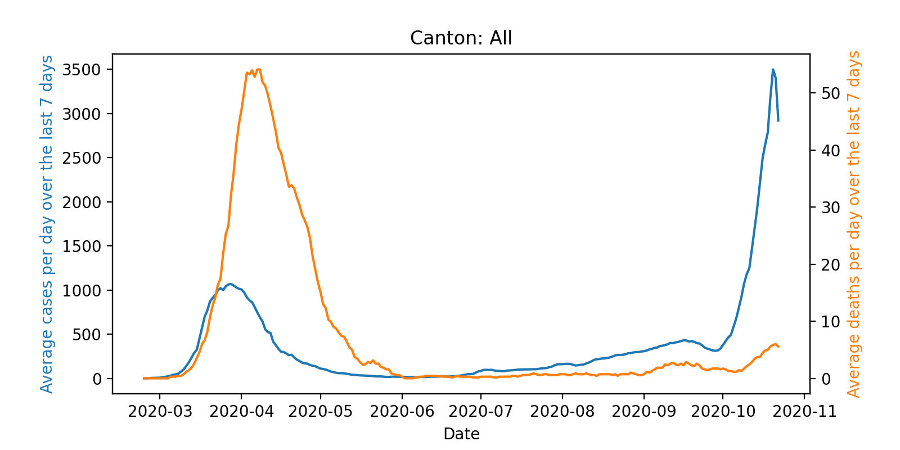

# Analyze the Swiss Corona cases with PySpark

This notebook downloads the data from official Swiss government site and analyzes the data with PySpark. The result visualizes the development of the reported cases and deaths, optionally per canton (see the plot below).

The required dependencies can be installed with [Conda](https://docs.conda.io/en/latest/). Just initialize your environment with the following commands.

```bash
conda env create -f environment.yml
conda activate analysis-env
```

The notebook runs also on [binder](https://mybinder.org/) thanks to the conda [`environment.yml`](environment.yml) you may find in the repo. Click the following badge to start the notebook on Binder.

[](https://mybinder.org/v2/gh/stwunsch/pyspark-swiss-corona-cases/main)


